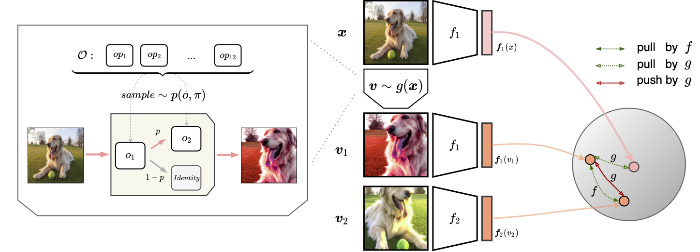
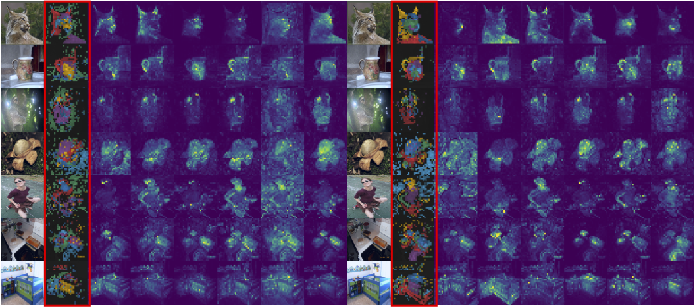

<div align="center">
<h1> AutoView </h1>
<span><font size="5", > Learning Self-Regularized Adversarial Views for Self-Supervised Vision Transformers
 </font></span>
</br>
Tao Tang∗, Changlin Li∗, Guangrun Wang, Kaicheng Yu, Xiaojun Chang, Xiaodan Liang<sup><span>&#8224;</span></sup>

(<span>*</span>: equal contribution, <span>&#8224;</span>: corresponding author)

<br>

<div><a href="https://arxiv.org/pdf/2210.08458.pdf">[arXiv Preprint]</a></div> 

</div>


## Introduction



We propose **AutoView**, a self-regularized adversarial AutoAugment method, to learn views for self-supervised vision transformers. 

* First, we reduce the search cost of AutoView to nearly zero by learning views and network parameters simultaneously in a single forward-backward step, minimizing and maximizing the mutual information among different augmented views, respectively. 
* Then, to avoid information collapse caused by the lack of label supervision, we propose a self-regularized loss term to guarantee the information propagation. 
* Additionally, we present a curated augmentation policy search space for self-supervised learning, by modifying the generally used search space designed for supervised learning. 
* On ImageNet, our AutoView achieves remarkable improvement over RandAug baseline (+10.2% k-NN accuracy), and consistently outperforms *sota* manually tuned view policy by a clear margin. Extensive experiments show that AutoView pretraining also benefits downstream tasks and improves model robustness.


## Visualization



## Getting Started

````bash
git clone https://github.com/Trent-tangtao/AutoView.git
````

This is a preliminary release. We have not carefully organized everything now.


## Citation

If you find AutoView is useful in your research or applications, please consider giving us a star &#127775; and citing it by the following BibTeX entry.

```bibtex
@article{tang2022learning,
  title={Learning Self-Regularized Adversarial Views for Self-Supervised Vision Transformers}, 
  author={Tao Tang and Changlin Li and Guangrun Wang and Kaicheng Yu and Xiaojun Chang and Xiaodan Liang},
  journal={arXiv preprint arXiv:2210.08458},
  year={2022}
}
```
